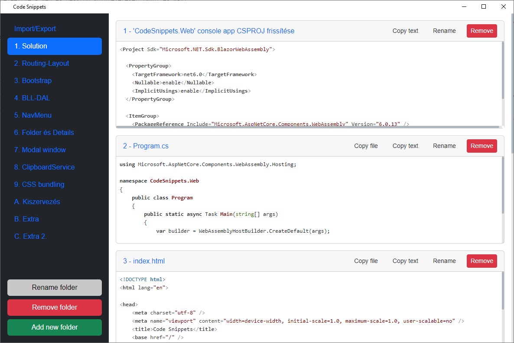

# BlazorCodeSnippets

BlazorCodeSnippet egy Blazor-alapú eszköz, amely nemcsak a fejlesztők munkáját könnyíti meg live coding bemutatók során, hanem egyben technológiai demóként is szolgál, bemutatva, hogyan lehet a Blazor-t több platformon is használni, beleértve a web és desktop környezeteket (MAUI és WPF).

## Főbb funkciók:
- **Kódrészletek másolása és beillesztése**: A fejlesztők egyszerűen, Ctrl+C, Ctrl+V billentyűparanccsal másolhatják és illeszthetik be az előre definiált kódrészleteket, megkönnyítve a live coding demókat.
- **Kódrészletek rendszerezése**: A snippet-ek mappákba és almappákba rendezhetők, címekkel láthatók el a gyors keresés és könnyebb átláthatóság érdekében.
- **Platformfüggetlen és platformspecifikus megoldások**: A projekt több platformon fut, weben (Blazor WebAssembly) és desktopon (MAUI és WPF), ezzel bemutatva a Blazor képességeit.

## Projektek és platformok:
A projekt négy különálló részből áll, amelyek mind különböző platformokon futnak:

- **BlazorCodeSnippets.Common**: Ebben a projektben találhatók a platformfüggetlen logikai és UI komponensek, amelyeket minden platform használ.
- **BlazorCodeSnippets.Web**: Ez a webes platformon futó Blazor WebAssembly alkalmazás, amely a code snippet-ek webes verzióját valósítja meg.
- **BlazorCodeSnippets.Maui**: Egy desktop alkalmazás, amely a .NET MAUI keretrendszerre épül, és platformspecifikus kódokat tartalmaz a desktop futtatáshoz.
- **BlazorCodeSnippets.Wpf**: Egy WPF-alapú desktop alkalmazás, amely a Blazor-t WPF környezetben használja, bemutatva a technológia rugalmasságát ezen a platformon is.

## Cél és felhasználás:
Az alkalmazás célja, hogy a fejlesztők könnyebben kezeljék és rendszerezzék a kódrészleteiket, miközben egy technológiai demóként is szolgál, bemutatva a Blazor alkalmazásának lehetőségeit különböző platformokon. Hasznos eszköz fejlesztői demók során, ahol a kódrészletek előre elkészítve állnak rendelkezésre, ezáltal gyorsítva a bemutatót és segítve a demó folyamatát.

## Projekt elindítása:
A programot érdemes a WPF projektet kijelölve elindítani. Ebben beimportálható a mellékelt *demo_snippets.txt* fájl. Ez a fájl egy előre elkészített snippet gyűjteményt tartalmaz, amely magának a BlazorCodeSnippets alkalmazásnak a felépítését mutatja be. Az importálás után a fejlesztő könnyedén lépésről-lépésre követheti a program építését (és így akár egy live coding bemutatót is tarthat minden kódrészletet időben beillesztve).
